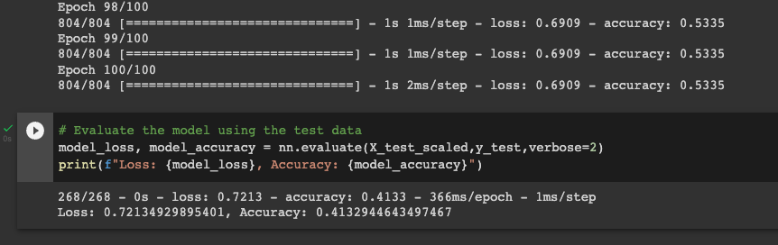
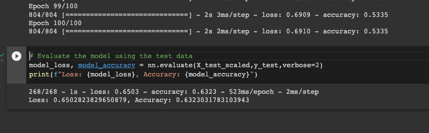
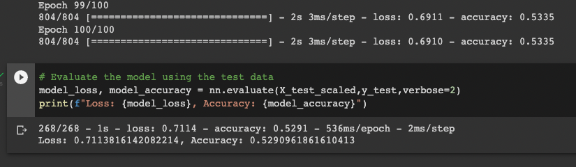

# Neural_Network_Charity_Analysis

## Overview/Purpose
The purpose of this analysis was to use machine learning and neural networks to help a charity determine if applicants will be successful with the funds invested by the charity. The dataset contains over 34,000 organizations that have received funding from this specific charity throughout the years of operation. Creating a more efficient model to determine the success rate of applicants can change the way investments are made, thus allocating funds to organizations that are statistically more likely to succeed with the charity's funding.  

## Results

### Data Processing
  
  
  
  - The target(s) for this model is the 'IS_SUCCESSFUL' column of the dataset.  This data tells us if the organization with successful with the previous funding from the charity.  
  - The features for this model are 'APPLICATION_TYPE', 'AFFILIATION', 'CLASSIFICATION', 'USE_CASE', 'ORGANIZATION', 'INCOME_AMT', and 'ASK_AMT'. 
  - The variables that should be removed from the data include 'NAME', 'EIN' (identification column), 'STATUS' (if a project is still in progress, it will not show up as complete), and 'SPECIAL_CONSIDERATIONS'. I chose to eliminate special considerations and also use case to try to achieve higher success rates with the model, but this backfired and brought my model's accuracy down. 

### Compiling, Training, Evaluating Model
Since my second model ('AphabetSoupCharity_Optimization2.ipynb') gave me the best accuracy out of the three attempts that I made at bettering the initial model, I am using that one to provide context to the following points:
  - I actually kept the neurons and layers the same in this model with 2 hidden layers (80 in layer 1, 30 in layer 2).  I also used 'relu' application for the layers (until using 'sigmoid' for my output layer) because that was giving me the best accuracy when running the model.  I did not mess with the layers or neurons in this model because I felt like I was overfitting with some of my previous attempts.  I wanted to go back to a similar starting spot as the original model, and this seemed to benefit me the most out of the different layers, activations, and neuron changes that were made when optimizing.
  - I was not able to achieve the target model performance of 75% accuracy.  My accuracy actually went down quite a bit in each of my attempts, so I did much more harm to the original model than good.  I felt like I was making logical changes, bucketing when appropriate, and using neurons and hidden layers to my advantage but my results showed decreases compared to the original. 
  - I tried adding up to 3-4 hidden layers with parameters above 20,000, and this did not help with making the model more accurate.  I also tried using different activations other than 'relu' but that did not appear to help either.  I eliminated the 'SPECIAL_CONSIDERATIONS' and 'STATUS' columns as well to try to clean up the dataset more, but that was to no avail as well.  I was very worried about overfitting the dataset after seeing how the accuracy went down when adding various neurons and layers.  

### Results from 3 different attempts:

Attempt 1

Attempt 2

Attempt 3

## Summary

Overall, deep learning models like these can be very helpful for predicting future decisions in finance, business, retail, etc. Being able to train models to become more accurate is a skill that takes time to develop, but once it is mastered it can end up being a very valuable tool to bring to the table.  

The original model had the highest accuracy out of these 4 at 68%. This isn't extraordinary, especially with finances on the line, but this model could serve as a good starting spot to determining safe investments.  There are many features to take into consideration when trying to modify a neural network model like this one, so modifying the data to be as "computer friendly" as possible is very important for attaining the highest accuracy with the least amount of loss.  
